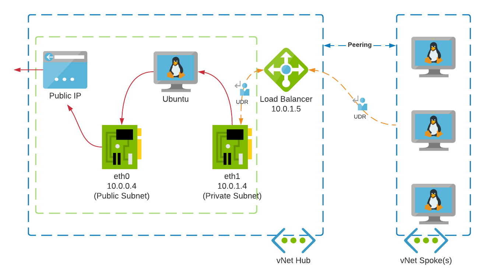

# Azure NAT with Linux VM

This repo describes how to deploy a basic Ubuntu VM that can be utilised for basic egress testing in a DEV environment. It was born out of the need to replace expensive Palo Altos as a task to ensure that we have egress for some resources. Unfortunately our setup already had an Azure Firewall, and it was sitting in the same vnet that we need to swap the Palo's out with; due to the subnet naming requirement of Azure Firewall, we couldn't have two subnets named `AzureFirewallSubnet` in the same vnet, else this would have been our choice. We wanted something simple that didn't require another license or manual setup; it had to be something that can be deployed and destroyed as PRs are raised.



First, I must give kudos to the following guide which helped my colleague and I start our investigation: https://www.microcloud.nl/azure-nat-with-ubuntu-linux/. It was a good guide to start with, but it was missing the code behind the deployment and didn't include multi vnet peering as we have in our environment; thus some learning curves frustratingly occurred.

Since you can view the code in the repo I am not going to go through step by step what is needed. I will, however, make some important notes on things we learnt during our process.

*NOTE: Please see the shell script in the hub module for the configuration of Ubuntu for IpTables and internal routing to help grasp the following:* [Ubuntu Shell script](ubuntu_hub/routing.sh)

## Public NIC should be  ethernet ZERO (`eth0`)

Azure sets the default traffic on `eth0` device; unless you want to mess about with resetting all the routes, I suggest you ensure the public NIC is the first device. You can see in the Terraform code that the way to specify this is to ensure that the NIC is the first in the list of connected devices.

https://registry.terraform.io/providers/hashicorp/azurerm/latest/docs/resources/linux_virtual_machine

*"network_interface_ids - (Required). A list of Network Interface ID's which should be attached to this Virtual Machine. The first Network Interface ID in this list will be the Primary Network Interface on the Virtual Machine."*

## Private NIC must have 'IP forwarding settings' enabled

See Microsoft reference:

https://docs.microsoft.com/en-us/azure/virtual-network/virtual-networks-udr-overview#user-defined 

*"Any network interface attached to a virtual machine that forwards network traffic to an address other than its own must have the Azure Enable IP forwarding option enabled for it. The setting disables Azure's check of the source and destination for a network interface. Learn more about how to enable IP forwarding for a network interface. Though Enable IP forwarding is an Azure setting, you may also need to enable IP forwarding within the virtual machine's operating system for the appliance to forward traffic between private IP addresses assigned to Azure network interfaces. If the appliance must route traffic to a public IP address, it must either proxy the traffic, or network address translate the private IP address of the source's private IP address to its own private IP address, which Azure then network address translates to a public IP address, before sending the traffic to the Internet."*

## Ensure a User Defined Route is attached to the trust NIC

Unless a UDR was attached to the trusted subnet NIC, you need to enable an NSG rule on the trusted private subnet for all CIDR ranges in the allow list regardless of the default `AllowVnetInBound` rule (for some reason it just doesn't take on vnet peering `¯\_(ツ)_/¯` ), This UDR needs to have `0.0.0.0/0` pointing back to the load balancer in the hubs trusted subnet.

## Add an internal route for your entire network CIDR

If you pay close attention to the shell script you will see that I had to have a route going back through `eth1` for a CIDR range that's matched to our environment. This ensures traffic doesn't get dropped or try go back out `eth0`

## Don't forget to add an internal route for the Azure Load Balancer!

*(Ditto) If you pay close attention to the shell script you will see that I had to have a route going back through `eth1` for an IP that's matched to* Azure Load Balancer (among other things; see https://docs.microsoft.com/en-us/azure/virtual-network/what-is-ip-address-168-63-129-16). If you perform a bare installation without this route you should notice that it's going out the wrong ethernet device (`eth0`) by default. Therefore any health probing done by the LB is not being sent back to advise "all is OK" and the VM is working as expected.

## TcpDump is your friend :)

https://www.tcpdump.org/

I was having an absolutely nightmare tracing traffic until a colleague suggested I use TcpDump. We could see traffic leaving the spoke, but I had no idea how to see if it was being received. Feel free to look up the manual pages, but here were a few commands that I found very useful when running on the *Hub* VM.

- Check if traffic coming from a particular VM in the spoke: `sudo tcpdump -n -i eth1 host 10.0.2.4`
- Check all traffic coming in from a CIDR range: `sudo tcpdump -n -i eth1 net 10.0.2.0/24`

```text
# example of listening to the subnet traffic from the hub VM

adminuser@ubuntu-uks-hub:~$ sudo tcpdump -n -i eth1 net 10.0.2.0/24

tcpdump: verbose output suppressed, use -v or -vv for full protocol decode
listening on eth1, link-type EN10MB (Ethernet), capture size 262144 bytes
12:57:46.866201 IP 10.0.2.4.38602 > 20.60.17.100.443: Flags [S], seq 1697665004, win 64240, options [mss 1418,sackOK,TS val 740904274 ecr 0,nop,wscale 7], length 0
12:57:46.868063 IP 20.60.17.100.443 > 10.0.2.4.38602: Flags [S.], seq 1915343262, ack 1697665005, win 8192, options [mss 1440,nop,wscale 8,sackOK,TS val 1394501588 ecr 740904274], length 0
12:57:46.892450 IP 10.0.2.4.38602 > 20.60.17.100.443: Flags [.], ack 1, win 502, options [nop,nop,TS val 740904277 ecr 1394501588], length 0
12:57:46.892450 IP 10.0.2.4.38602 > 20.60.17.100.443: Flags [P.], seq 1:518, ack 1, win 502, options [nop,nop,TS val 740904278 ecr 1394501588], length 517
```

```text
# an example of checking Azure load balancer heartbeat from the hub VM

adminuser@ubuntu-uks-hub:~$ sudo tcpdump -n -i eth1 host 168.63.129.16

tcpdump: verbose output suppressed, use -v or -vv for full protocol decode
listening on eth1, link-type EN10MB (Ethernet), capture size 262144 bytes
12:59:14.019615 IP 10.0.1.4.52852 > 168.63.129.16.80: Flags [S], seq 3876913316, win 64240, options [mss 1460,sackOK,TS val 1241806992 ecr 0,nop,wscale 7], length 0
12:59:15.026014 IP 10.0.1.4.52852 > 168.63.129.16.80: Flags [S], seq 3876913316, win 64240, options [mss 1460,sackOK,TS val 1241807999 ecr 0,nop,wscale 7], length 0
12:59:16.057191 IP 168.63.129.16.51029 > 10.0.1.4.22: Flags [R.], seq 3468754684, ack 3167860511, win 0, length 0
12:59:16.064262 IP 168.63.129.16.51131 > 10.0.1.4.22: Flags [SEW], seq 1496490971, win 8192, options [mss 1440,nop,wscale 8,nop,nop,sackOK], length 0
12:59:16.064305 IP 10.0.1.4.22 > 168.63.129.16.51131: Flags [S.], seq 288649560, ack 1496490972, win 64240, options [mss 1460,nop,nop,sackOK,nop,wscale 7], length 0
```

## NSG Flow Logs is *also* your friend

If you’re getting nowhere with TcpDump and have NFI where to look next; check that traffic is hitting the NSG and what rule is being applied to it. I usually performed a `curl` from the spoke VM and remember the IP it resolves the URL as, then look I it up in the logs (*NOTE: it can take 5-10min for the logs to generate a JSON file in your specified storage account*).

## Netplan and Cloud Init confuses Morbo!

I had tried messing around with the routing by using Netplan and, as it suggested, disabled the default Cloud Init config, but it never worked for me. Perhaps one day I will invest more time in setting the routing via this method properly, but for now it is slightly hacky as an `rc.local` start up script to re-add the routes upon reboot (Cloud Init removes/reconfigures it on each boot). Hey, it's just for testing anyway...!

Netplan documentation: https://netplan.io/reference/

```
# A 'cat' of 50-cloud-init.yaml:

# This file is generated from information provided by the datasource.  Changes
# to it will not persist across an instance reboot.  To disable cloud-init's
# network configuration capabilities, write a file
# /etc/cloud/cloud.cfg.d/99-disable-network-config.cfg with the following:
# network: {config: disabled}
network:
    ethernets:
        eth0:
            dhcp4: true
            dhcp4-overrides:
                route-metric: 100
            dhcp6: false
            match:
                driver: hv_netvsc
                macaddress: 00:0d:3a:7e:9f:c3
            set-name: eth0
        eth1:
            dhcp4: true
            dhcp4-overrides:
                route-metric: 200
            dhcp6: false
            match:
                driver: hv_netvsc
                macaddress: 00:0d:3a:7e:93:0b
            set-name: eth1
    version: 2
```

